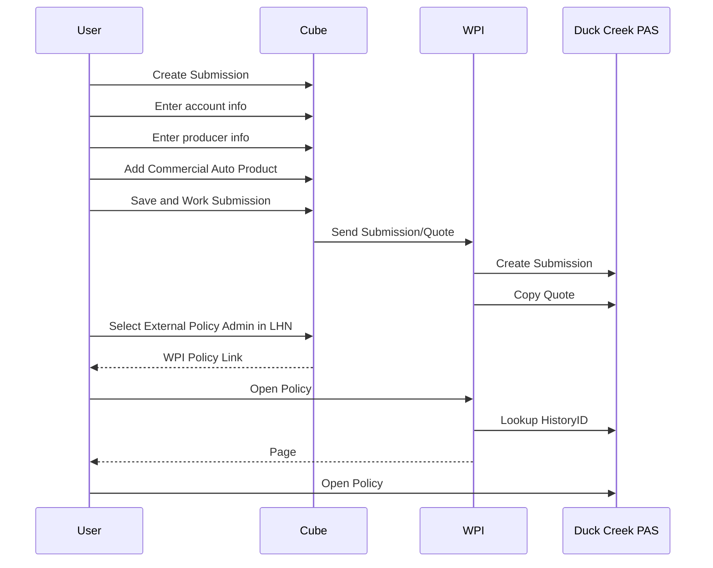
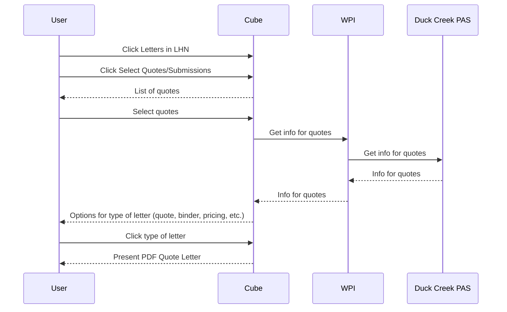
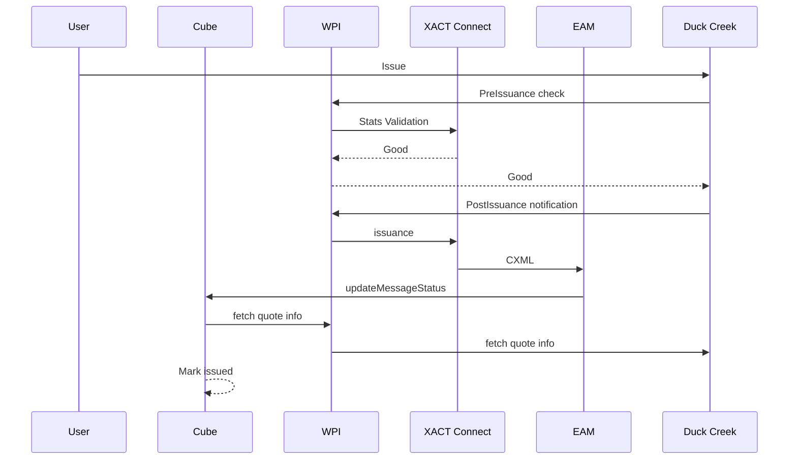
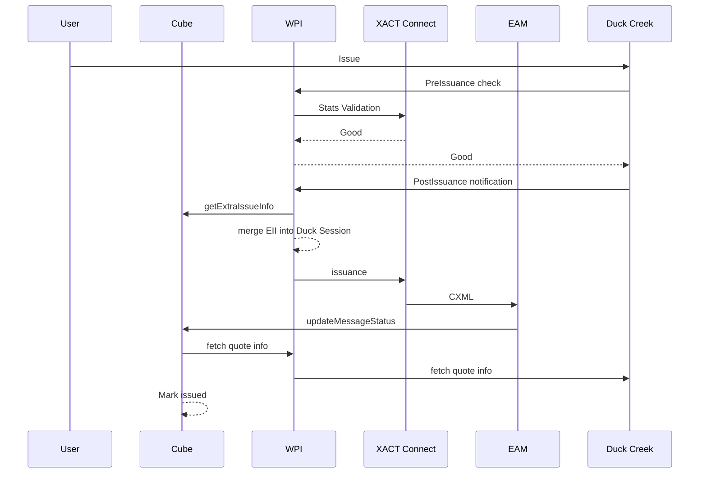

# Initial design of queueing mechanism between Duck Creek and CUBE

## Business Objective (Problem Statement specific to functionality/component)

The business has a desire to use multiple PAS systems through CUBE to
write a variety of lines of business starting with Business Auto. The
integration is required to be efficient, smooth and cost effective at
initiation and updates. Some of the updates may include additional data
enrichment prior to submission, changes in data elements or additional
rules to be followed by users in the appropriate PAS system.

### Design Goals and Priorities

The following goals are listed descending order of priority to guide
conflict resolution.

1. Speed to Market
2. Long-Term Maintainability
3. Flexibility
4. Resiliency
5. Consistency with Cube and Legacy Systems
6. Cost
7. User Experience

The following constraints are also applied:

1. There will be no data synchronization.
2. There will be no data migration.
3. Cube will not have any Commercial Auto product awareness
4. All interactions with Duck Creek with be initiated from within Cube.

## Integration Approach

### Integration Tier

A set of services that translate between Cube and Duck Creek.

The primary benefit from intoducing the integration tier will be the
limited changes required to Cube which will allows for minimal release
coordination with Duck Creek. This approach also minimizes the chance of
negatively impacting Cube during its production push for Workers Comp.

The integration tier also provides a platform for future growth. While
requests arriving from Cube will be simply routed to Duck Creek, it's a
simple move to introduce a content based router so that multiple PASs
can be used and selected based upon product or submission information.
Similary, the simple interface to Cube can also be utilized by any
future directions in Underwriter Workbench.

The introduction of the integration tier does not leave Cube completely
untouched. Cube will still require modifications to feed submission
information to and receive status updates from the integration tier.
However, this interface should be fairly static and require infrequent
updates.

### Workbench PAS Interface (WPI)

The WPI is the realization of the Integration Tier between an
Underwriter Workbench (initially Cube) and a number of Policy Admin
Systems (initially Duck Creek). The implementation calls for simple
interfaces on both sides to facilitate simple and quick integrations.
While the WPI will initially simply pass thru requests from Cube to Duck
Creek, there is a content aware router so that the UW isn't even aware
of what PASs it's handing off to.

The UW and PAS interfaces will be synchronous in phase 1 to allow the
WPI to simply act as a router and provide simpler integration. Errors
propagating messages from the UW to a PAS will result in an error
response that can then be displayed to the user. Attempting to navigate
to a PAS before the submission has been successfully set up will
likewise result in an error. Each of the messages will be defined as
idempotent to facilitate a safe strategy of retries in the event of
possible failures. The messages themselves will contain enough
information so that any message can be processed independent of any
missed prior messages with the exception of the initial submission
creation in the PAS.

### Interfaces

#### Cube to WPI

* **New Business**:
* **Endorsements**:
* **Cancel**:
* **Reinstatement**:
* **Temporary Reinstatement**:
* **Cancel/Rewrite**:
* **Cancel Reason Change**:
* **Renewal**:
* **Non-renewal**:
* **Non-renewal Reason Change**:
* **Reversal of Non-renewal**:
* **Quote Letter**:

#### WPI to Duck Creek PAS

* **New Business**:

  * **Submission**:
    * **Submission id**:
    * **Customer code**:
    * **Business Unit**:
    * **BU Code**:
    * **BU Name**:
    * **Producer Code**:
    * **Product Symbol**: "CAP"
    * **Policy Effective Date**:
    * **Policy Expiration Date**:
    * **Primary Insured**:
    * **Full name**:
    * **Legal Entity**:
    * **Legal Entity Other Type**:
    * **Address Line 1**:
    * **Adress Line 2**:
    * **City**:
    * **State**:
    * **Postal Code**:
    * **Phone number**:
    * **Email**:

* **Endorsements**:
  * **Transaction Effective Date**:
  * **Transaction Type**:
  * **Transaction Sub Type**:

* **Cancel**:
* **Reinstatement**:
* **Temporary Reinstatement**:
* **Cancel/Rewrite**:
* **Cancel Reason Change**:
* **Renewal**:
* **Non-renewal**:
* **Non-renewal Reason Change**:
* **Reversal of Non-renewal**:

#### Duck Creek PAS to GA Policy Number Generator

#### Submission Mapping

| Element                                         | Cube   | Duck Creek                                                        |
|:------------------------------------------------|:-------|:------------------------------------------------------------------|
| businessUnit.code                               |        | **policy/businessUnit/code**                                      |
| businessUnit.name                               |        | **policy/businessUnit/name**                                      |
| customer.number                                 |        | **data/account/CustomerNumber** (also in quote somewhere)         |
| effectiveDate                                   |        | **policy/EffectiveDate** ManuScriptBroker.listRq/effectiveDateNew |
| expirationDate                                  |        | **policy/ExpirationDate**                                         |
| submissionId                                    |        | **policy/PolicyNumber** policy/QuoteNumber                        |
| policyStatus                                    |        | (2)                                                               |
| primaryInsured.address.city                     |        | **account/address/City**                                          |
| primaryInsured.address.line1                    |        | **account/address/Address1**                                      |
| primaryInsured.address.line2                    |        |                                                                   |
| primaryInsured.address.postalCode               |        | **account/address/ZipCode**                                       |
| primaryInsured.address.state                    |        | **account/address/State**                                         |
| primaryInsured.emailAddress                     |        | **account/Email**                                                 |
| primaryInsured.legalEntity                      |        |                                                                   |
| primaryInsured.name                             |        | **account/Name**                                                  |
| primaryInsured.name2                            |        |                                                                   |
| primaryInsured.phoneNumber                      |        | **account/PrimaryPhone**                                          |
| producer.code                                   |        | **data/producerDetails/Code**                                     |
| producer.profitCenter                           |        | **data/producerDetails/ProfitCenter**                             |
| quoteStatus                                     |        |                                                                   |
| sourceSystem                                    | "Cube" | **policy/SourceSystem**                                           |
| symbol                                          | (1)    | (1)                                                               |
| transactionEffectiveDate                        |        |                                                                   |
| transactionSubType (keep around for short rate) |        |                                                                   |
| transactionType                                 |        |                                                                   |
| underwriter                                     |        |                                                                   |

Note: When a submission element maps to multiple Duck Creek values, the value will be read from the one bolded.
Note 1: CAP <--> CommercialAuto
Note 2: On the Duck side, Quote, InForce or Cancelled for policy status. Pending or Committed as the transaction status.

### Flows

#### Create Duck Submission

#### Duck Quote Letter

Currently, the only way to initiate Quote Letter generation is from
Cube.

#### Duck Issuance

#### Duck OOS Issuance

## References

### API Design

* **[Richardson Maturity Model](https://martinfowler.com/articles/richardsonMaturityModel.html)**:
  Excellent description for Level 3 REST service and how they differ
  from other levels.
* **[Best Practices for Designing a Pragmatic RESTful API](https://www.vinaysahni.com/best-practices-for-a-pragmatic-restful-api)**:
  Taken as recommendations and not prescriptions. For instance, we're
  going with HATEOAS even tho it may not quite be mainstream as of yet.
* **[RESTful API Strategy](https://github.com/restfulapi/api-strategy)**:
  Provides guidance regarding the development of non-trivial
  resource-oriented and RESTful HTTP APIs.
* **[RESTful API Design. Best Practices in a Nutshell.](https://blog.philipphauer.de/restful-api-design-best-practices/)**:
  Best practices for building HTTP and RESTful APIs.
* **[Best Practices for API Error Handling](https://nordicapis.com/best-practices-api-error-handling/)**:
  The WPI is being designed to handle distributed failures from the
  beginning. This document guide how these errors will be communicated
  to CUBE.
* **[Optimistic Locking in a REST API](https://sookocheff.com/post/api/optimistic-locking-in-a-rest-api/)**:
  Not yet sure if submissions will benefit from locking, but this is how
  we'll do it if they will.

### Libraries

* **[Spring Boot]()**:
* **[Spring Cloud Sleuth](https://cloud.spring.io/spring-cloud-sleuth/)**:
  Provides a distributed tracing solution so that requests can be
  correlated across CUBE, the WPI and Duck Creek. Waiting for 2.0.0 to
  be finalized before integrating as the current releases conflict with
  Spring Boot 2.0.1.
* **[Spring HATEOAS](https://projects.spring.io/spring-hateoas/)**:
  Provides an easy to use framework for linking resources.
* **[Spring Plugin](https://github.com/spring-projects/spring-plugin)**:
  For implementing the Duck Creek SPI within the WPI if we go down that
  path.
* **[Spring REST Docs](https://projects.spring.io/spring-restdocs/)**:
  Generates API documentation from marked up unit tests.
